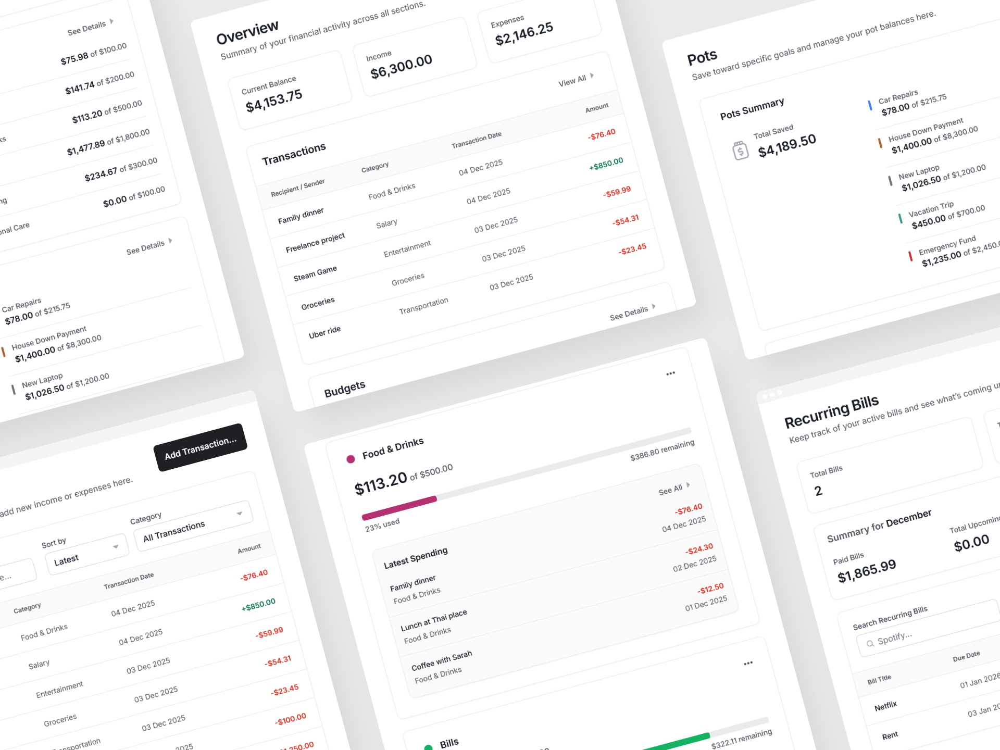

# Personal Finance App

A Finance management app with transaction tracking, budget management, savings goals, and recurring bill monitoring.

### Links

- Live site: [https://personal-finance-darkstar.vercel.app](https://personal-finance-darkstar.vercel.app/transactions)
- Storybook: https://686e3fe27611a7cc8167dd9d-oklnboabxr.chromatic.com/

#

### Built with

- Next.js 15
- TypeScript
- Tailwind
- Tailwind Variants - This was super useful when a base component would have multiple variants. Ex: Button component
- React Aria Components - Accessible and headless components
- Prisma ORM
- Supabase (Postgres)
- Zod - For input data validation
- React Hook Form - Form state manager, works nicely with Zod via the resolver
- D3 - For the donut charts
- jose - JWT creation/verification
- bcryptjs - Password hashing
- Motion - Some small animations throughout the app Ex: Sidebar, dropdowns etc.
- Storybook - Component and accessibility tests. Also visual tests on Chromatic
- Playwright - E2E tests

#

### Features

- 6 routes including Overview, Transactions, Budgets, Pots, Recurring Bills and Account Settings.
- Transactions
  - Create incoming or outgoing transactions.
  - View past transactions: Supports searching, filtering, sorting and pagination.
  - Ability to create the transaction as a monthly recurring transaction.
- Budgets
  - Create monthly budgets for transaction categories.
  - View existing budgets and edit or delete them.
  - Each budget displays the recent outgoing transactions for the budget, the total spent, and remaining spendable amount.
  - Shows a warning message when the monthly spent for the category has exceeded the budget.
  - Donut chart for viewing all existing budgets and their values at a glance.
- Pots
  - Create saving pots to track savings towards a custom goal.
  - View existing pots and edit or delete them.
  - Add or withdraw money from pots.
- Recurring bills
  - View currently active recurring bills: Supports searching and sorting.
  - View the bill title, next due date, days until next due date, and amount.
  - Displays a summary of recurring bills for the _current month_ including the total paid bills, upcoming bills and soon due bills (within 7 days).
  - Delete any active recurring bill.
- Overview
  - View totals for the current balance, income and expenses.
  - View overview’s of all 4 above routes at a glance.
- User account management
  - Supports creating new accounts using email and password.
  - Supports editing account details such as email, username and password.
  - Supports deleting accounts, including all the data the user has created under that account.

#

### Technical Details

- All base components are built on top of React Aria Components. They are headless components so all styles were done by me using Tailwind. Each base component has it’s own Storybook entry.
- All inputs have client side validation along with server side validation.
- All data mutations are done using Server Actions, and all data fetching is done in Server Components. No client side fetching so no 3rd party fetching libraries or useEffects.
- I wrote the auth myself so it’s a very simple setup (bit too simple I would say). Upon account creation or login, a JWT is created using `jose` by storing the `userId` as the payload. Then the JWT is stored in a cookie from server side as a `httpOnly` cookie. Passwords are hashed using `bcryptjs` before storing in the database.
- On each request, middleware (`proxy.ts` in Next.js 16) reads and checks the cookie (session) and if invalid, redirects the user to a public route (`/login`). All database queries are called via functions defined in the data access layer, and each of those functions again checks the validity of the cookie (session) before executing the database query.
- I used Tanstack Table for the first time, just to get familiar with it and see what features it offers. But I don’t think I used much features from it. Filtering, sorting and pagination were all done server side, so the table library already received the data in the shape it needs to be rendered in.
- I maintained two databases. Supabase cloud DB for production and a local Supabase instance running inside a docker container for development. Used the environment variables to switch between the two setups. Vercel would have env variables pointing to production and my local env file would have variables pointing to the local Supabase instance.
- Used husky with a simple pre commit hook that would check for linting and type errors (this was helpful on more occasions than I’d like to admit).
- GitHub Actions had few tests like linting and type checking, Storybook tests, Playwright E2E tests and Storybook publishing to Chromatic. I set the actions to run on each PR to `main` (this will run the actions on the feature branch) and also on each push to `main` (this will run the actions on the `main` itself after the PR is merged).
- Disabled direct pushes to `main` in GitHub repo settings, so all commits have been made via feature PR’s. I also squashed and merged each PR. I think the commit history looks much more cleaner and organized that way.
- I used Linear to track issues so all feature branch names were from Linear.

#

### Credits

- Project idea and the initial design files were from Frontend Mentor: https://www.frontendmentor.io/challenges/personal-finance-app-JfjtZgyMt1
- Design system used in the final result is from Untitled UI: https://www.untitledui.com/figma
- Brand logo from Untitled UI’s free logo pack: https://www.untitledui.com/logos

#

- My Frontend Mentor profile - [@DarkstarXDD](https://www.frontendmentor.io/profile/DarkstarXDD)
